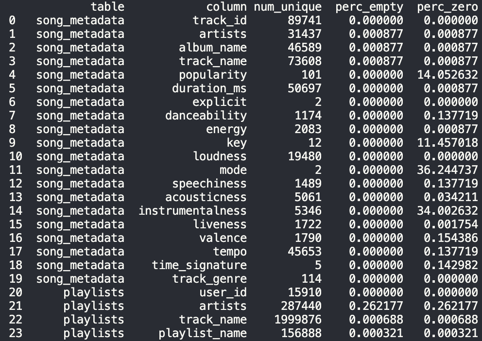

Sydney Lynch

# Spotify Playlist->Song Recommender

My goal for this project is to use song metadata with user playlists to create a model that recommends a song based on an existing playlist. To do so, I hope to use two datasets that I found on Kaggle:

Song Metadata — from [Spotify Tracks Dataset (Kaggle)](https://www.kaggle.com/datasets/maharshipandya/-spotify-tracks-dataset)

This file (song_metadata.csv) has 114,000 songs × 21 columns describing attributes like artist, track name, genre, tempo, and then more unusual features like danceability, energy, valence, and acousticness.

Playlists — from [Spotify Playlists Dataset (Kaggle)](https://www.kaggle.com/datasets/andrewmvd/spotify-playlists)

This file (playlists_clean.csv) has ~12.8 million playlist entries × 4 columns linking users, tracks, and playlist names. The main information I hope to get from this playlist is on user preferences, so I do not have to solely rely on the metadata.

This dataset combination supports a music recommender system where I can use existing/previous playlist combinations to predict songs to add to other playlists. I am hoping to use both datasets together to capture relationships between users, tracks, and audio features.

## Data Exploratory Process and Main Findings

Immediately starting off, I ran into issues. My dataset with 12+ million rows would not load into a pandas dataframe. Some rows had titles with nested quotes, which ended up breaking the pandas parser, so I tried reading it again while skipping any misaligned rows, and found that only 8 rows had this issue. Since 8 rows are largely insignificant to the 12million rows, I decided to just drop them rather than finding them individually to fix the formatting.

Then, I checked for any missing values throughout both files. A few columns had a handful of missing values, with `artists` from the playlist file having the most missing rows on only 0.26% = ~3350 rows. Again, since 3k is significantly less than the given 12 million rows, I decided to just drop these rows since artist is an important column for merging the two datasets together. Additionally, most columns that had a significant amount of zeros were ordinal where 0 implied a specific feature. The exceptions were `popularity` and `instrumentalness`, which to me seemed like fine features to have many 0s in. I briefly then looked at the distributions for each column, and none seem to have any strange/unexplainable values.

> 

> screenshot of output describing the amount of empty rows per column

First, I explored the song metadata dataset. One of the first things I noticed was that some of the most repeated song names were holiday themed, such as “Run Rudolph Run”, “Halloween”, and “Frosty the Snowman”. I found this very strange because what are the odds that of the 114k songs, how were over 100 about Rudolph? But after some exploring, I discovered how there were **exactly 1000 songs per** `track_genre`. My understanding is that of 1000 songs of a Christmas-like genre, it makes sense that there are 50 variations of the “Run Rudolph Run” song, where when only considering 1000 pop songs, there is likely less overlap on one specific track. Nothing seemed out of the ordinary when looking at the album names or artists.

>   
> 

> screenshot of the top30 track names and artists

I then tried to explore the song metadata features (like `energy` and `valence`) and see if there was any correlation between any of them but did not notice any too significant from this analysis. Many of the features seem to have a strong right skew, but some did seem to have a more normal distribution, like `tempo` and `danceability`. Surprisingly to me however, when looking at the correlations, there seems to be basically no correlation between `danceability` and `tempo`.

> 
> 

> correlation heatmap between and distributions of various metadata features

I then tried splitting the songs by `track_genre`, but the resulting correlations and distributions did not seem to change much.

Trying to make more sense of the metadata features, I picked a few songs to listen to and see if the features made intuitive sense. The first song I chose randomly was Gen Hoshino – I Wanna Be Your Ghost (feat. Ghosts) which had a `danceability` score of 0.9, which seemed to make sense to me. But then the next song was "Memories acoustic" with a score of 0.8, even though the two songs had a very different ‘dance’ vibe to me. But who am I to say. I figured that these features might be good to use as more latent features, where I focus more on the features such as the track titles, genre, tempo, and popularity.

Then, I began looking at the playlist dataset. First, I wanted to understand more about how long/how many playlists there were, so I plotted the lengths of playlists. My initial plot just showed a large bar at 0 with seemingly nothing else. After looking at the distribution, I realized that a large majority of playlists are less than 100 songs, but there are many with up to 47-thousands songs. Further exploration revealed that most of these very large playlists are from users ‘Starred’ playlist, which is likely from users that use the favorites folder as an umbrella bucket for every song they like.

> 

> distribution of playlist lengths

```
Playlist lengths:
mean         55.356460
std         271.157445
min           1.000000
25%          11.000000
50%          16.000000
75%          38.000000
max       47309.000000
```

When looking at the top artists and track names, the artists seemed as expected, similar to the song metadata, but the track names had the opposite type of pattern. Rather than the top songs being niche songs, like Christmas songs, they were songs that had simple, common titles like “You”, “Stay”, and “Heaven”, which is closer to what I was expecting from these two datasets.

## Issues and Open Questions

With these main findings, and some more poking around, I felt like I had a better understanding of the dataset and what features could be good to use for the recommender, so I then spent a little time trying to merge the two datasets together. But I was running into many problems with overlapping names, and various versions of the same song. Since the playlist dataset had 12 million rows, only a handful had a matching row in the metadata dataset, which could also cause problems. However, I think that there is enough rows in each, where the resulting merged dataset should have enough.

A main open question is whether differences across duplicate entries, like varying genre labels or album releases, could contain meaningful information or simply reflect noise in the data. Deciding how to handle these variations could be crucial for my model.
