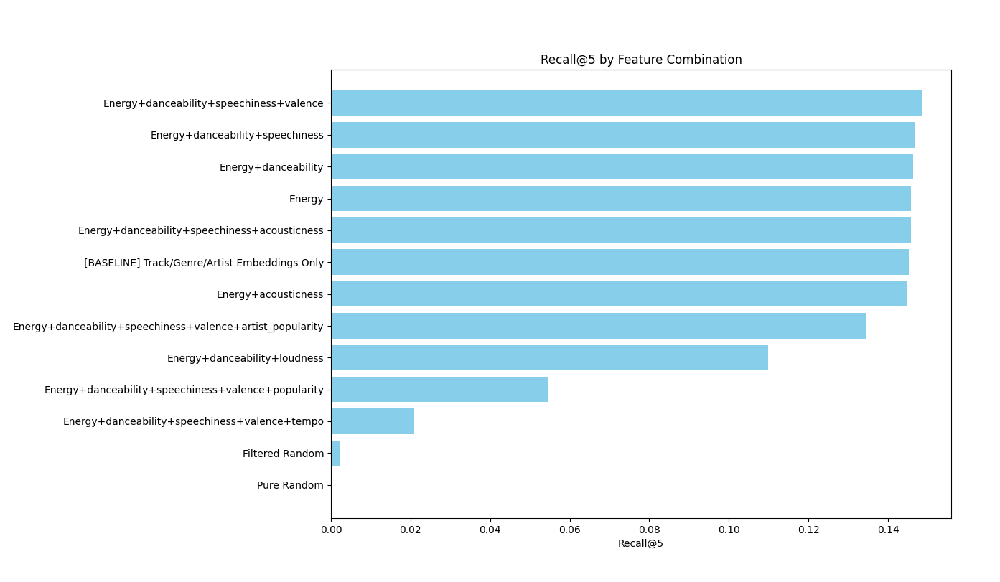
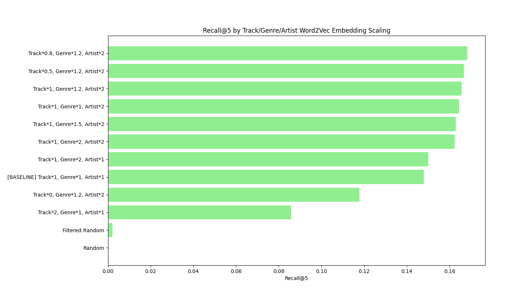
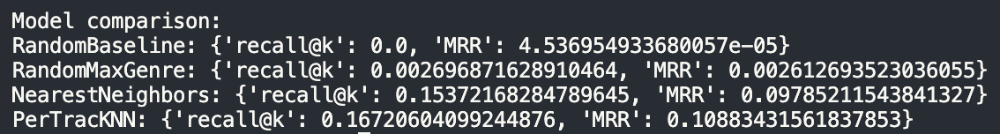

Sydney Lynch

# Playlist-Based Music Recommendation Using Song Metadata and User Playlists

## 1. Introduction

This project is a music recommender system that predicts songs to add to an existing playlist by leveraging both song metadata and user playlists. The core idea is to capture user preferences via playlists while also incorporating audio and track-level features to improve recommendations. The final model, a Per-Track kNN recommender using these features with various Word2Vec embeddings, achieved a recall@5 of ~0.16, outperforming naive genre-based baselines by over 60x.

I used two datasets from Kaggle:

1. **Song Metadata** — [Spotify Tracks Dataset](https://www.kaggle.com/datasets/maharshipandya/-spotify-tracks-dataset) (song_metadata.csv): 114,000 songs × 21 columns, including artist, track name, genre, tempo, and features like danceability, energy, valence, and acousticness.
2. **Playlists** — [Spotify Playlists Dataset](https://www.kaggle.com/datasets/andrewmvd/spotify-playlists) (playlists_clean.csv): ~12.8 million playlist entries × 4 columns, linking users, tracks, and playlist names.

This combination supports a recommender system where I can use historical playlist compositions to predict songs for other playlists. While metadata captures content features, playlists provide implicit collaborative signals that help capture user taste.

---

## 2. Data Exploration & Preprocessing

The metadata and playlist datasets required minimal cleaning. Eight malformed playlist rows were dropped, along with ~0.26% of playlist entries with missing artist names to preserve merge integrity. The song metadata showed uniform sampling with exactly 1000 tracks per genre, explaining repeated holiday-themed titles. Some songs appeared multiple times under different genres, which were combined into a single row with concatenated genres to produce 81,343 unique songs. Feature inspection revealed right-skewed distributions for most audio attributes, with tempo and danceability closer to normal. These numerical features were put through a Standard Scalar to remove any accidental bias of one feature over the otheres. Correlations across metadata features were generally low, including between danceability and tempo, indicating that these attributes capture largely independent dimensions. Playlist analysis showed high variance in playlist size (1 to 47,309 tracks), with a large majority of playlists containing <50 songs. Very large playlists were almost entirely “Starred” collections.

Merging playlists with metadata was challenging due to inconsistent naming and multiple versions of the same track, resulting in relatively few exact matches. Out of the original 12.8 million playlist entries, only 871,873 (≈6.8%) matched cleanly to the 81k-song metadata catalog. Despite the low match rate, the resulting subset is still sufficiently large for modeling.

---

## 3. Modeling & Feature Development

### Evaluation Strategy

I created an evaluator to consistently measure model performance:

1. Hide 2 songs per playlist for `n_samples=2000` playlists that had a length >4 and <300.
2. Feed remaining playlist tracks into the model.
3. Get top k=5 recommendations.
4. Calculate `recall@5` and `MRR` for the hidden songs.

Recall@5 was chosen because the goal is to recover hidden songs; precision is capped at 0.4 (5 recommendations for 2 hidden songs) and would artificially lower F1. MRR helps gauge how highly ranked the hidden songs are among the predictions.  
In the first draft, evaluation used the same playlists to train embeddings, introducing data leakage. This was corrected by splitting playlists into train (90%) and test (10%), computing embeddings on the train set only, and evaluating exclusively on the test playlists.

---

### Baselines

1. **RandomBaseline** — randomly recommends a song. Recall@5 ≈ 0.0001 with an increase of 10,000 samples from the default 2000.
2. **RandomMaxGenre** — randomly selects a song with the playlist’s most common genre. Recall@5 ≈ 0.002. Quick to run and slightly personalized but still generic.

---

### KNNCentroid

I used KNN to find songs nearest to a playlist centroid (averaged track features). This model was used for the majority of my feature tuning/engineering.

> **Note:** the recall@5 scores referenced below were calculated before the data leakage issue was fixed. The true scores without leakage are about 5% lower, but I kept the numbers from the first draft to demonstrate consistent comparison between features.

#### Metadata Feature Selection

- Metadata features improving recall: `danceability`, `energy`, `speechiness`, `valence`.
- Features that decreased recall: `popularity`, `artist_popularity`, `tempo`.

#### Playlist-Based Word2Vec Embeddings

To leverage playlists more directly, I trained three separate Word2Vec embeddings:

1. **Track ID embeddings** — captures co-occurrence of tracks in playlists.
2. **Genre embeddings** — captures stylistic/theme co-occurrence.
3. **Artist embeddings** — captures artists frequently appearing together.

Including any single embedding increased recall@5 from ~0.003 to 0.08, and all three together achieved ~0.14. Scaling embeddings further optimized recall@5 to ~0.168: `track_id * 0.8`, `track_genre * 1.2`, `artist * 2`.

>   
> Ranking of recall@5 by song metadata feature combinations

>   
> Ranking of recall@5 by track/genre/artist embedding scaling

---

### PerTrackKNN

Once strong features were selected, I began testing new models. Instead of condensing playlists to a centroid, PerTrackKNN recommends based on individual tracks, aggregating the most frequent suggestions. With the same tuned features and embeddings, recall@5 increased to 0.1822, capturing more playlist nuance.

### Additional Models

I also tested a Random Forest regression-based recommender, but training on 80k+ items with high-dimensional feature vectors was very slow and memory-intensive. Given the scale of the dataset, I opted to stick with the kNN-based recommenders for this project.

### Final Model Scores (after adjusting for no leakage)

> 

> Evaluator recall@5 and MRR across models

---

## 4. Sample Recommendations

To check qualitative performance, I created two small playlists:

**Moody Teen Pop** (7 tracks) and **Basic Rap** (4 tracks). Top 10 recommendations for each using the final model included reasonable choices, with tracks matching genres and artists. The top recommendation for **Moody Teen Pop** was ABBA's _Does Your Mother Know_, and for **Basic Rap** was Eminem’s _Rap God_.

---

## 5. Analysis & Conclusion

Playlist-derived embeddings provide a much stronger representation of user taste than raw metadata, and the per-track aggregation method preserves important playlist-level nuance. These design choices contribute to the model’s substantial performance gain over simple baselines, achieving roughly a 60× improvement compared to the genre-based random recommender.

I believe that a recall@5 of 0.16 is strong given the scale of the problem. The model selects 5 tracks from a catalog of ~81k songs and successfully retrieves the hidden tracks 16 percent of the time, far outperforming naive approaches (genre recall ≈0.0027). This indicates that the playlist-aware embeddings are capturing meaningful structure in user behavior rather than relying on superficial metadata correlations.

While the current system provides a solid baseline that leverages both playlist co-occurrence patterns and key metadata features, its performance could likely improve with richer and more complete song metadata. Improving the consistency of track identifiers and increasing the proportion of playlist entries that successfully match to metadata would give the model access to far more training signals. A larger matched set could support more similarity estimates and allow the recommender to generate more flexible and nuanced predictions.
