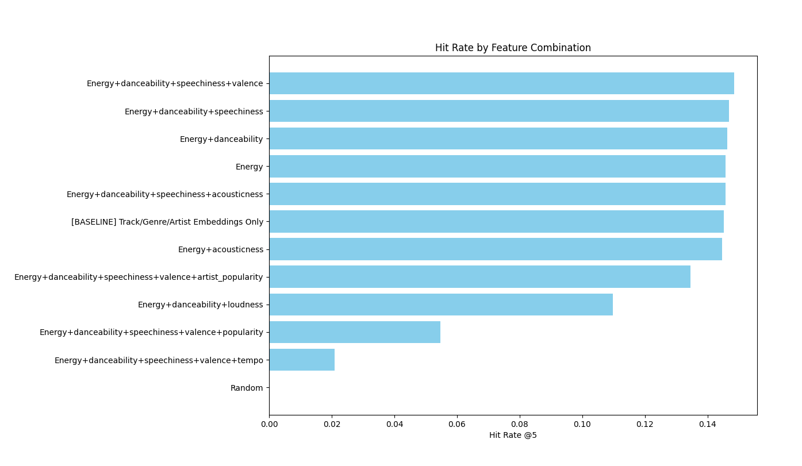
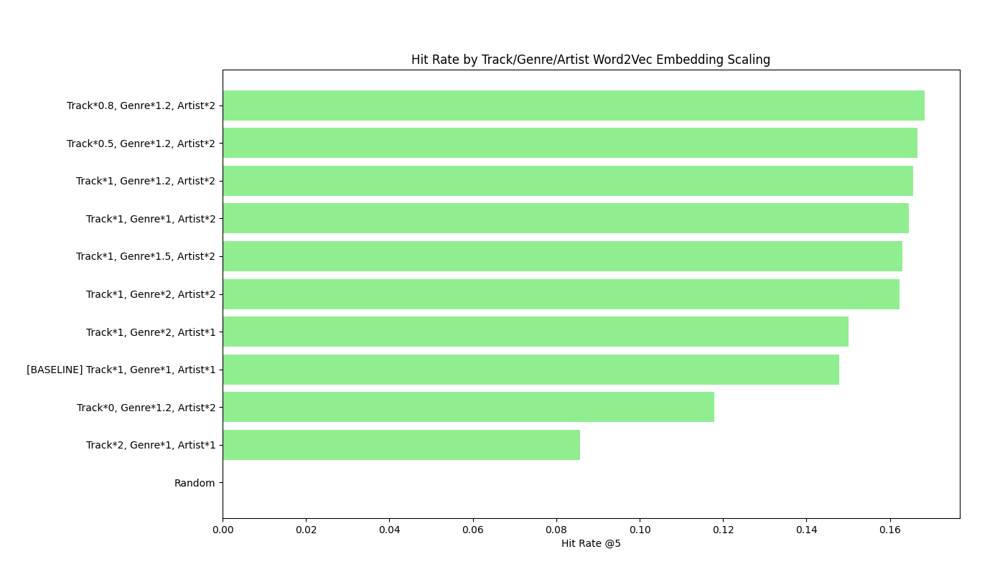
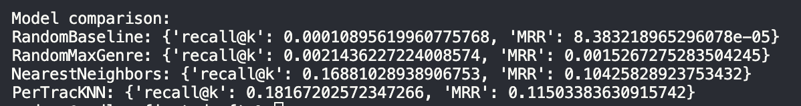

Sydney Lynch

# Spotify Playlist->Song Recommender

## Creating My Evaluator

Before I began creating models, I wanted to plan out my evaluator so I would have a consistent measure throughout my modeling process. Ultimately, my evaluator for each of n_samples=2000 playlists:

- Hides 2 songs in the playlist
- Feeds the remaining playlist’s tracks in the recommender model
- Gets the top k=5 recommendations from the model
- Calculates the recall@5 and the MRR (Mean Reciprocal Rank) based on the 2 hidden

I chose to use **recall@5** as my main evaluator metric because I wanted to track how good my model is at fetching the desired results, without penalty for finding additional incorrect recommendations. Since my evaluator is grabbing 5 recommendations to attempt to find 2 songs, the precision would be capped at 0.4, and in turn drag down F1. Ideally, the model finds the 2 hidden songs, regardless of what the other 3 recommendations are since the other 3. Additionally, I then calculated the **MRR** to try to gauge if the hidden songs that are recommended are highly ranked amongst the predictions.

## Modeling and Feature Development

### Pure Random – `RandomBaseline`

For my first model, I wanted to have a very simple, random baseline to compare all future models against. I quickly created a baseline that would simply return a random song. This model had a recall@5 of effectively 0, with an occasional score 0.0001 when run with n_samples=10000 instead of my standard 2000. Clearly, there are many weaknesses to the model since it takes in no context and cannot make a personalized recommendation, but it is very quick to run for the same reason.

### Filtered Random – `RandomMaxGenre`

For a different simple random baseline, I created a model that randomly selects a song that has the same genre of the most common genre in the given playlist. This model performed much better than the pure random model, with a score of **0.002** (x20 better than pure random). This model has the strength of being quick to run since no heavy feature preprocessing is needed, and has some personalization by filtering by genre, but is still very generic to produce meaningful results.

### `KNNCentroid`

For my first non-random model, I used KNN to find songs similar to a ‘centroid’ track of the playlist’s averaged values. I decided to use `euclidean` distance because I wanted to be able to scale different features to weigh more than others during my feature tuning. I used this model for majority of my feature tuning/engineering.

#### Feature Engineering

To pick features, I first needed to merge the two datasets together, which was causing problems. There were many duplicates of the same tracks, but listed under different genres, so I ultimately merged them to average all to store a list of all genres it was listed as. With this new column storing the list of genres, `track_genres`, I wanted to try Multi-Hot Encoding (_MultiLabelBinarizer_) because I figured that genre would be a pretty important feature for the model. I quickly learned that this was simply too much noise since there were 114 different genres, causing a lot of sparsity and overpowering everything else.

I then wanted to utilize TF-IDF on `track_name` to see if the model could make any meaningful groupings. But, this seemed to be too noisy and sparse still, with a recall@5 of barely 0.003, which is right around the filtered random model.

I was loosing hope in the content-based approach I was going towards, but the only information I have on user interaction and preference is from the playlists dataset, which only has the lists of tracks per playlist. I decided to lean into the playlists more and created **three separate** **_Word2Vec_** **embeddings** to capture contextual relationships within playlists:

1. **Track ID embeddings**: Each playlist’s sequence of track IDs is treated as a “sentence.” Tracks that frequently appear near each other in playlists end up with similar vector representations, capturing co-occurrence patterns across playlists.
2. **Genre embeddings**: Each playlist is represented as a sequence of genres from its tracks. Genres that tend to appear together in playlists get similar embeddings, capturing stylistic or thematic relationships.
3. **Artist embeddings**: Similarly, each playlist is treated as a sequence of artists. Artists that commonly co-occur in playlists are represented closely in the embedding space.

Including even just one of these 3 embeddings increased my recall@5 from ~0.003 to **0.08** (x26 better than the filtered random), and including all 3 increased my recall@5 to around **0.14** (x47 better than the filtered random).

With these vector embeddings as my new base point, I turned back to the song metadata to see if there was any value from the strange numeric values that the dataset came with (`loudness`, `danceability`, etc). I tested various combinations of these features and found that `danceability`, `energy`, `speechiness`, and `valence` increased the recall@5 by a little bit. Surprisingly to me, `popularity`, `artist_popularity`, and `tempo` dropped the metrics the most even though those were the features that I thought would help the most. I believe these features were weighing too heavily and overpowering the other features, and adding unneeded noise. These features did not seem to change the model too much, since they are likely overpowered by the 3x 32-dimension vector embeddings, but I decided to keep them small since I wanted the user-interactions learned from the embeddings to be the primary driving force of the model, rather than the content features. This overall, got my recall@5 up to around **0.15** (x50 better than the filtered random).

> 

> Ranking of recall@5 by song metadata feature combinations

I then messed with scaling the word2vec embeddings. Each of the 3 embeddings are 32-dimensions to not dramatically overweigh the other, but then I scaled the columns with different constants to see if some embeddings were more valuable than the others. The highest scoring combination of scalars was `track_id * 0.8`, `track_genre * 1.2`, and `artists * 2` with a recall@5 of about **0.168** (x58 better than filtered random).

> 

> Ranking of recall@5 by track/genre/artist word2vec embedding scaling

At this point, I was pretty happy with my features and felt that they were meaningful to some degree, where consistently over 15% of the 2-hidden-songs-per-playlist were accurately being recommended.

### `PerTrackKNN`

The KNNCentroid was good for testing different features, but since it condensed each playlist to one track to find its recommendations, it was missing out on potentially a lot of nuance between the individual tracks on the playlist. So, I created a KNN model that created a song suggestion based on each track in the playlist, and return the suggestions that appeared the most as the final recommendation. Without changing any of the features that were hypertuned for the KNNCentroid, the recall@5 immediately went up to **0.1822** (x85 better than filtered random). This model can more accurately reflect the trends of the playlist by considering more nuance about each track when creating the recommendations.

## Final Evaluations

> 

> Each model’s evaluator recall@5 and MRR scores

## Additional Evaluation

Even though the numbers seem to indicate that the model is doing decently well, or at least better than random, I wanted to see what the model would do with a sample playlist that I created. So, I created two very small playlists:

```
=== Moody Teen Pop ===
                     track_name            artists                         track_genre  popularity
track_uid
70831           Sweater Weather  The Neighbourhood  [pop, alternative, rock, alt-rock]          93
73006              Another Love          Tom Odell                        [pop, chill]          93
10807      Locked out of Heaven         Bruno Mars                             [dance]          87
24744                      Lost        Frank Ocean                              [soul]          85
11160             Electric Love              BØRNS                              [rock]          82
691               Dancing Queen               ABBA                           [swedish]          83
1419        Rolling in the Deep              Adele                     [british, soul]          81


=== Basic Rap ===
                                    track_name  artists track_genre  popularity
track_uid
32637                           No Role Modelz  J. Cole   [hip-hop]          88
21835                               Not Afraid   Eminem   [hip-hop]          81
57561      Bohemian Rhapsody - Remastered 2011    Queen      [rock]          82
21839                               Without Me   Eminem   [hip-hop]          88
```

Which produced the following 10 recommendations each:

```
=== Moody Teen Pop recommendations ===
                               track_name      artists      track_genre  popularity
track_uid
1421                        Rumour Has It        Adele  [british, soul]          67
10811      Treasure - Cash Cash Radio Mix   Bruno Mars     [pop, dance]           2
10806                Just the Way You Are   Bruno Mars          [dance]          82
10809                 Talking to the Moon   Bruno Mars     [pop, dance]          82
692                 Does Your Mother Know         ABBA        [swedish]          66
10810                  That's What I Like   Bruno Mars          [dance]          83
1423                 Set Fire to the Rain        Adele  [british, soul]          80
24747                            Novacane  Frank Ocean           [soul]          81
690                            Chiquitita         ABBA        [swedish]          74
10808                           Moonshine   Bruno Mars     [pop, dance]           4


=== Rap recommendations ===
                                         track_name      artists track_genre  popularity
track_uid
21837                           The Real Slim Shady       Eminem   [hip-hop]          87
21836                                       Rap God       Eminem   [hip-hop]          78
38107                                    The Prayer     Kid Cudi   [hip-hop]           0
21838         Venom - Music From The Motion Picture       Eminem   [hip-hop]          74
21834      Lose Yourself - From "8 Mile" Soundtrack       Eminem   [hip-hop]          79
57560                             Bohemian Rhapsody        Queen      [rock]          75
52118                         Pistol Pistol (Remix)   Obie Trice  [hardcore]          58
41672                                       On Fire  Lloyd Banks  [hardcore]          64
41673                                Warrior Part 2  Lloyd Banks  [hardcore]          60
52119                                     The Setup   Obie Trice  [hardcore]          61
```

These are using the final model, and do not seem too bad! Throughout the feature engineering process, this created very… interesting… results, such as Olivia Rodrigo songs for the Rap playlist, even though the scoring metrics were increasing.

## Final Ideas

I think that this KNN model + evaluator is a good baseline for the final model. Future things to try include:

- Hypertuning the embedding dimensionality (16 vs 32 vs 64)
- Testing different algorithms other than KNN (e.g. RandomForest)
- Evaluating with more hidden songs per playlist and experimenting with other metrics
